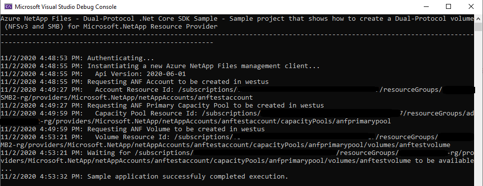

# Azure NetAppFiles SDK Sample - Dual-Protocol for .NETCore 

This project demonstrates how to create a dual-protocol Volume (uses both SMB/NFSv3 protocol types) for Microsoft.NetApp resource provider using .NETCore SDK.

In this sample application we perform the following operations: 

* Creations
    * ANF Account
    * Capacity Pool
    * Dual-Protocol Volume
* Deletions
    * Dual-Protocol Volume
    * Capacity Pool
    * ANF Account 

>Note: The cleanup execution is disabled by default. If you want to run this end to end with the cleanup, please
>change value of boolean variable 'shouldCleanup' in program.cs  

If you don't already have a Microsoft Azure subscription, you can get a FREE trial account [here](http://go.microsoft.com/fwlink/?LinkId=330212). 

## Prerequisites

1. Azure Subscription.
1. Subscription needs to be enabled for Azure NetApp Files. For more information, please refer to [this](https://docs.microsoft.com/azure/azure-netapp-files/azure-netapp-files-register#waitlist) document.
1. Make sure you comply with the dual-protocol items described [here](https://docs.microsoft.com/en-us/azure/azure-netapp-files/create-volumes-dual-protocol#considerations) before you proceed.
1. Have the Root CA certificate used by the AD Domain Controller and the Windows clients exported as Base64 encoded X.509 certificate file.
If unsure, steps 2-3 in [this](https://docs.microsoft.com/en-us/azure/azure-netapp-files/create-volumes-dual-protocol#upload-active-directory-certificate-authority-public-root-certificate) document shows how to export the certificate.
Make sure this file is stored at the root of the project.
1. Resource Group created. 
1. Virtual Network with a delegated subnet to Microsoft.Netapp/volumes resource. For more information, please refer to [Guidelines for Azure NetApp Files network planning](https://docs.microsoft.com/en-us/azure/azure-netapp-files/azure-netapp-files-network-topologies)
1. For this sample console appplication work, we are using service principal based  authenticate, follow these steps in order to setup authentication:
    1. Within an [Azure Cloud Shell](https://docs.microsoft.com/en-us/azure/cloud-shell/quickstart) session, make sure you're logged on at the subscription where you want to be associated with the service principal by default:
        ```bash
        az account show
        ``` 
        If this is not the correct subscription, use             
          ```bash
         az account set -s <subscription name or id>  
         ```
    1. Create a service principal using Azure CLI
        ```bash
        az ad sp create-for-rbac --sdk-auth
        ```

        >Note: this command will automatically assign RBAC contributor role to the service principal at subscription level, you can narrow down the scope to the specific resource group where your tests will create the resources. 

    1. Copy the output content and paste it in a file called azureauth.json, secure it with file system permissions and save it outside the tree related of your 	local git repo folder so the file doesn't get commited. 
    1. Set an environment variable pointing to the file path you just created, here is an example with Powershell and bash:
        Powershell 
        ```powershell
       [Environment]::SetEnvironmentVariable("AZURE_AUTH_LOCATION", "C:\sdksample\azureauth.json", "User")
       ```
        Bash
        ```bash
        export AZURE_AUTH_LOCATION=/sdksamples/azureauth.json
        ``` 

        >Note: for more information on service principal authentication with dotnet, please refer to [Authenticate with the Azure Libraries for .NET](https://docs.microsoft.com/en-us/dotnet/azure/dotnet-sdk-azure-authenticate?view=azure-dotnet)

# What is netappfiles-dontnetcore-pool-change-sdk-sample doing? 

This sample is dedicated to demonstrate how to create a dual-protocol Volume using an ANF Account name in Azure NetApp Files.
Dual-protocol volumes use both SMB and NFS protocol types.
Similar to other ANF SDK examples, the authentication method is based on a service principal. This project will first create an
ANF Account with an Active Directory object using the Root CA certificate mentioned in the prerequisites section.
Then a capacity pool is created, and finally a single dual-protocol volume using Standard service level tier.
When executing this application, the user will be prompted to provide the password for the Active Directory User that has permission to domain join computers in AD.

There is a section in the code dedicated to remove created resources. By default this script will not remove all created resources;
this behavior is controlled by a boolean variable called 'shouldCleanup' in the program.cs class. If you want to erase all resources right after the
creation operations, set this variable to 'true'.
If any of the earlier operations fail for any reason, the cleanup of resources will have to be done manually.

# How the project is structured

The following table describes all files within this solution:

| Folder      | FileName                | Description                                                                                                                         |
|-------------|-------------------------|-------------------------------------------------------------------------------------------------------------------------------------|
| Root        | program.cs              | Authenticates and executes all operations                                                                                           |
| Root		  | Creation.cs				| Performs the creation operations of resources																						  |
| Root 		  | Delete.cs 				| Performs the delete operations of the created resources																			  |
| Root\Common | ResourceUriUtils.cs     | Static class that exposes some methods that helps parsing Uris, building a new Uris or getting a resource name from Uri for example |
| Root\Common | ServicePrincipalAuth.cs | Small static class used when working with Service Principal based authentication                                                    |
| Root\Common | Utils.cs                | Static class that exposes a few methods that helps on various tasks, like writting a log to the console for example.                |
| Root\Model  | AzureAuthInfo.cs        | Class that defines an Azure AD Service Principal authentication file                                                                |

# How to run the console application

1. Clone it locally
    ```powershell
    git clone https://github.com/Azure-Samples/netappfiles-dotnetcore-dual-protocol-sdk-sample.git
    ```
1. Make sure you change the variables located at the top of **netappfiles-dotnetcore-dual-protocol-sdk-sample\src\anf-dotnetcore-dual-protocol-sdk-sample\program.cs class**
1. Change folder to **netappfiles-dotnetcore-dual-protocol-sdk-sample\src\anf-dotnetcore-dual-protocol-sdk-sample**
1. Since we're using service principal authentication flow, make sure you have the **azureauth.json** and its environment variable with the path to it defined (as previously described)
1. Build the console application
    ```powershell
    dotnet build
    ```
1. Run the console application
    ```powershell
    dotnet run
    ```

Sample output


# References

* [Azure NetAppFiles SDK Sample for .NETCore - More advanced example](https://docs.microsoft.com/en-us/samples/azure-samples/netappfiles-dotnetcore-sdk-sample/azure-netappfiles-sdk-sample-for-netcore/)
* [Authenticate with the Azure Libraries for .NET](https://docs.microsoft.com/en-us/dotnet/azure/dotnet-sdk-azure-authenticate?view=azure-dotnet)
* [Resource limits for Azure NetApp Files](https://docs.microsoft.com/en-us/azure/azure-netapp-files/azure-netapp-files-resource-limits)
* [Azure Cloud Shell](https://docs.microsoft.com/en-us/azure/cloud-shell/quickstart)
* [Azure NetApp Files documentation](https://docs.microsoft.com/en-us/azure/azure-netapp-files/)
* [Download Azure SDKs](https://azure.microsoft.com/downloads/)
 
